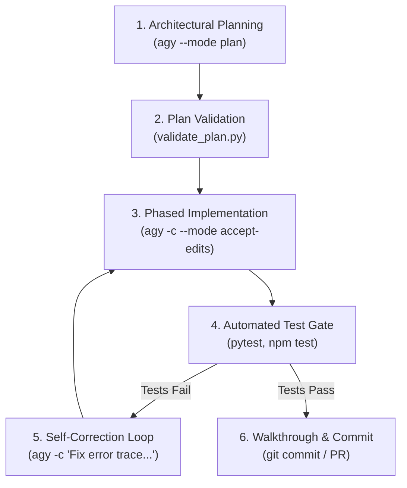

# Anti-Gravity Development Skill

A complete, production-grade guide for using Google's Anti-Gravity CLI (`agy`) across the entire software development lifecycle: architectural planning, session-continuous coding, test-driven verification, and self-correction error loops.



---

## When to Use

- **Full Feature Development**: End-to-end implementation from upfront system design to tested code.
- **Complex Multi-File Refactoring**: Decoupling components and upgrading legacy systems with safety tests.
- **Continuous Session Coding**: Generating plans and immediately applying edits without burning extra tokens on re-indexing.
- **Autonomous Agent Workflows (Hermes)**: Driving headless code generation and automated self-correction loops.
- **Test-Driven Development (TDD)**: Writing unit tests and production code in synchronized phases.

---

## Prerequisites

1. **Verify or Install Anti-Gravity CLI (`agy`)**:
   ```bash
   curl -fsSL https://antigravity.google/cli/install.sh | bash
   ```

2. **Check Version & Setup**:
   ```bash
   agy --version   # Requires v1.1.0+ (current: v1.1.21)
   which agy       # Typically ~/.local/bin/agy
   ```

3. **First-Time Authentication** (run interactively once if not yet authenticated):
   ```bash
   agy
   # Complete Google Cloud Code / Google account authentication flow
   ```

---

## The 5-Phase Development Lifecycle

### Phase 1: Deep Architectural Planning

Generate a comprehensive implementation plan before writing any code.

#### Headless / Non-Interactive (Autonomous Agents)
```bash
# Save PLAN.md directly in the project root directory
agy --mode plan -p "Plan user authentication with JWT and rate limiting" \
    --effort high \
    --dangerously-skip-permissions \
    --print-timeout 15m > ./PLAN.md
```

#### Interactive Planning Session
```bash
agy --mode plan
```

> [!TIP]
> **Plan Co-Location Best Practice**:
> Always save `PLAN.md` directly in the **project root directory** (e.g., `./PLAN.md` or `./.agents/plans/PLAN.md`):
> 1. **Automatic Context Discovery**: `agy` immediately sees and indexes `./PLAN.md` as part of the project workspace without needing `--add-dir`.
> 2. **Version Control Audit Trail**: The plan is committed alongside the code in Git, keeping implementation specs and commits aligned.
> 3. **Seamless Execution**: During Phase 3 execution (`agy -c`), referencing `./PLAN.md` resolves instantly in the working directory.
> 4. **Multi-Agent Collaboration**: All agents and subagents access the single source of truth in the project root.

---

### Phase 2: Plan Review & Structural Validation

Validate that the generated plan contains all necessary components before coding.

1. **Run Automated Plan Validator**:
   ```bash
   python3 scripts/validate_plan.py PLAN.md
   ```
2. **Multi-Turn Plan Refinement** (if modifications are needed):
   ```bash
   # Refine the plan in the SAME session
   agy -c "Add Redis-based sliding window rate limiting and update the testing strategy"
   ```

---

### Phase 3: Phased Implementation (Single Session Continuation)

Execute the approved plan step-by-step in the **exact same session** using `-c` / `--continue` to preserve conversational context and avoid re-indexing the repository.

```bash
# Implement Phase 1: Models & Migrations
agy -c "Approved. Implement Phase 1 from PLAN.md: Data models, hashing utils, and migrations." \
    --mode accept-edits \
    --dangerously-skip-permissions
```

#### Why Single-Session (`-c`) Is Critical
- **Zero Token Waste**: Reuses existing codebase analysis and file structure maps cached in the session.
- **Context Awareness**: `agy` retains the complete `PLAN.md` specification and previous turn decisions.
- **Speed**: Subsequent turns execute significantly faster via Gemini Context Caching.

---

### Phase 4: Automated Verification & Test Gates

Execute your project test suite immediately after each implementation phase:

```bash
# Run unit & integration tests
pytest tests/auth/ -v
# Or for JavaScript/TypeScript:
npm test
```

---

### Phase 5: Self-Correction & Error Feedback Loop

If tests, linters, or typecheckers fail, pass the error output directly back into the ongoing `agy` session:

```bash
# Feed test trace back into agy for self-correction
agy -c "The tests failed with:
FAILED tests/auth/test_jwt.py::test_expiry - KeyError: 'exp'
Fix token expiration claim generation in src/auth/jwt_handler.py." \
    --mode accept-edits \
    --dangerously-skip-permissions
```

Re-run Phase 4 tests. Repeat until all test gates pass.

---

## CLI Flag Reference (v1.1.21)

| Flag | Alias | Description |
|:-----|:------|:------------|
| `--mode <mode>` | | Agent execution mode: `plan` (planning first) or `accept-edits` (auto-apply code diffs) |
| `--continue` | `-c` | Continues the active session, preserving cached context and plan history |
| `--conversation <id>` | | Resumes a specific conversation thread by ID |
| `--print` | `-p` | Non-interactive execution; prints output directly to stdout |
| `--dangerously-skip-permissions` | | Auto-approves tool requests (required for autonomous headless scripts) |
| `--print-timeout <duration>` | | Execution timeout for print mode (e.g., `10m`, `20m`, `30m`) |
| `--effort <level>` | | Reasoning effort: `low`, `medium`, `high` |
| `--add-dir <path>` | | Add directory to active workspace context (repeatable) |
| `--model <model>` | | Explicit model selection override (e.g., `Gemini 3.7 Flash`) |
| `--output-format <fmt>` | | Output format: `text`, `json`, or `stream-json` |
| `--json-schema <schema>` | | Enforces JSON schema on structured outputs |
| `--sandbox` | | Runs command execution inside a secure terminal sandbox |

> [!WARNING]
> Do **not** use `--cwd`. Execute `agy` directly from the project directory or pass workspace paths using `--add-dir <path>`.

---

## Autonomous Agent Integration (Hermes & Python SDK)

### Option A: Subagent Execution via Shell (Hermes)
```python
import subprocess

def run_agy_step(prompt: str, mode: str = "accept-edits", continue_session: bool = True) -> str:
    """Executes an agy step preserving conversation context."""
    cmd = ["agy", "--mode", mode, "--dangerously-skip-permissions"]
    if continue_session:
        cmd.extend(["-c", prompt])
    else:
        cmd.extend(["-p", prompt])
        
    res = subprocess.run(cmd, capture_output=True, text=True, check=True)
    return res.stdout
```

### Option B: Programmatic Agent via Python SDK (`google-antigravity`)
```python
import asyncio
from google.antigravity import Agent, LocalAgentConfig, CapabilitiesConfig

async def develop_feature():
    config = LocalAgentConfig(
        system_instructions="You are an autonomous builder agent. Plan first, then implement and verify.",
        capabilities=CapabilitiesConfig()
    )

    async with Agent(config) as session:
        # Phase 1: Planning
        plan = await session.chat("Plan user authentication system")
        # Phase 2: Implementation in SAME session
        code = await session.chat("Implement Phase 1 from the plan")
```

---

## Helper Scripts

This skill includes automated helpers in the [`scripts/`](./scripts/) directory:

1. **[`scripts/validate_plan.py`](./scripts/validate_plan.py)**:
   Validates markdown plan structure against required sections.
   ```bash
   python3 scripts/validate_plan.py references/example-plan.md
   ```

2. **[`scripts/format_plan_prompt.py`](./scripts/format_plan_prompt.py)**:
   Constructs validated `agy` planning and execution commands.
   ```bash
   python3 scripts/format_plan_prompt.py "User Auth" -r "JWT" --effort high
   ```

---

## Reference Guides

- **Example Plan Template**: [`references/example-plan.md`](./references/example-plan.md)
- **Command Cheat Sheet**: [`templates/commands.md`](./templates/commands.md)

---

## Testing & Quality Assurance

Run the automated test suite to verify skill metadata, CLI syntax compliance, plan templates, and prompt builders:

```bash
bash tests/run_tests.sh
```
or via Python unittest:
```bash
python3 -m unittest discover -s tests -p "test_*.py" -v
```
